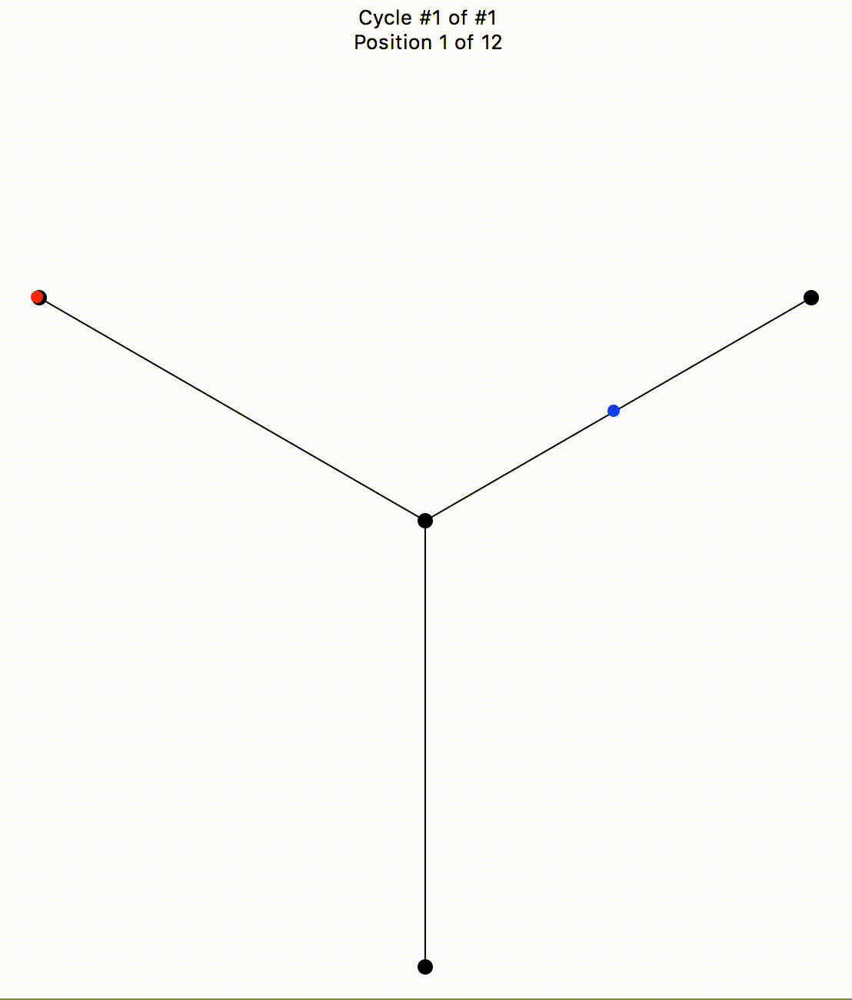

# Star Cycles!

This repository contains code written as part of a research project undertaken at Reed College in Summer 2019, which was led by [Prof. Safia Chettih](http://people.reed.edu/~safia/).

## Overview
The work undertaken for this project was largely an extension of Safia's doctoral dissertation, _Dancing in the Stars: Non-k-equal Configuration Spaces of Graphs_. Using code already written by Safia to construct [finite cubical complexes in SageMathCloud](https://doc.sagemath.org/html/en/reference/homology/sage/homology/cubical_complex.html) that represented the configuration spaces of stars, this code produces visualizations of _non-trivial cycles_ (moving from one configuration back to itself in a manner that isn't trivial).

#TODO: Write an introduction to robots, n and k, etc. Also link Abrams paper.

As an example, consider the graph that looks like a Y with 2 robots. Using the Abrams-discretized model, we are able to build the cubical complex D_{2,2}Y, which looks something like this:

#TODO: insert pic here of config space (12 0-cells, 12 1-cells).

The homology of this space is ____________.

And so we can see there is exactly one cycle, which as one might expect looks like this:

